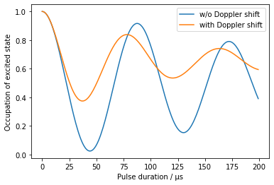

# `aisim` -- Simulations for light-pulse atom interferometry

## Installation

```
git clone https://github.com/bleykauf/aisim.git
cd aisim
python setup.py install
```

Alternatively, if you plan to make changes to the code, use

```
python setup.py develop
```

## Usage


```python
%matplotlib inline

import numpy as np
import matplotlib.pyplot as plt

import aisim as ais
```

Checking the currently installed version:


```python
print(ais.__version__)
```

    v0.4.0
    

## Examples

### Effect of wavefront aberrations in atom interferometry

As an example, we reproduce two plots from the paper https://link.springer.com/article/10.1007/s00340-015-6138-5.

The simulation will require the following objects and parameters
* `Wavefront`: contains the wavefront aberrations of the interferometry lasers
* `AtomicEnsemble`: an ensemble of atoms which different trajectors or phase space vectors
* `Detector`: determines which atoms contribute to the signal
* `t`: times of the three interferometer pulses

#### Loading and preparing wavefront data

Wavefront aberration in multiples of $\lambda$ = 780 nm. 

Load Zernike coefficients from file:


```python
coeff_window2 = np.loadtxt('data/wf_window2.txt')
coeff_window5 = np.loadtxt('data/wf_window5.txt')
```

Creating `Wavefront` objects and removing piston, tip and tilt from the data:


```python
r_beam = 11e-3 # radius of the available wavefront data in m

wf2 = ais.Wavefront(r_beam, coeff_window2)
wf5 = ais.Wavefront(r_beam, coeff_window5)
for n in [0,1,2]:
    wf2.coeff[n] = 0
    wf5.coeff[n] = 0
```


```python
wf2.plot()
fig, ax = wf2.plot_coeff()
```


```python
wf5.plot()
fig, ax = wf5.plot_coeff()
```


#### Creating an atomic ensemble

Due to the large number of parameters determining an atomic ensemble, dictionaries are used:


```python
pos_params = {
    'std_rho' : 3.0e-3, # cloud radius in m
    'std_z' : 0,        # ignore z dimension, its not relevant here
    'n_rho' : 20,       # within each standard deviation of the distribution we use 20 points
    'n_theta' : 36,     # using a resolution of 10°
    'n_z' : 1,          # use one value for the distribution along z
    'm_std_rho' : 3,    # use 3 standard deviations of the distribution, i.e. atoms up to 9 mm away from the center
    'm_std_z' : 0,      # ignore z dimension, its not relevant here 
    'weight' : 'gauss'  # each point on the grid is weighted according to a Guassian distribution
}

vel_params = {
    'std_rho' : ais.vel_from_temp(3e-6), # velocity spread in m/s from a temperature of 3 uK
    'std_z' : 0,                         # ignore z dimension, its not relevant here
    'n_rho' : 20,                        # within each standard deviation of the distribution we use 20 points
    'n_theta' : 36,                      # using a resolution of 10°
    'n_z' : 1,                           # use one value for the distribution along z
    'm_std_rho' : 3,                     # use 3 standard deviations of the distribution
    'm_std_z' : 0,                       # ignore z dimension, its not relevant here 
    'weight' : 'gauss'                   # each point on the grid is weighted according to a Guassian distribution
}

atoms = ais.create_ensemble_from_grids(pos_params, vel_params, state_vectors=[0, 1])
```

Plotting the grid and the weights:


```python
x = atoms.initial_position[:, 0]
y = atoms.initial_position[:, 1]
```


```python
fig, ax = plt.subplots()
ax.scatter(1e3*x, 1e3*y)
ax.set_aspect('equal', 'box')
ax.set_xlabel('x / mm')
ax.set_ylabel('y / mm')
```


    Text(0, 0.5, 'y / mm')


```python
fig, ax = plt.subplots()
ax.scatter(1e3*x, atoms.weights)
ax.set_xlabel('x / mm')
ax.set_ylabel('weights')
```


    Text(0, 0.5, 'weights')


#### Setting up the detector

We want to calculate the dependency of the phase shift caused by wavefront aberrations on the detection area. For this reason, we set up a Detector with varying detection radius within a for-loop.


```python
t_det = 778e-3 # time of the detection in s
```

#### Simulation the bias in gravity from wavefront aberrations

For the simulation we need the objects created above and the timing of the interferometer sequence.


```python
T = 260e-3 # interferometer time in s
t1 = 129.972e-3 # time of first pulse in s
t2 = t1 + T
t3 = t2 + T
t = [t1, t2, t3]
```


```python
awf_win2 = []
awf_win5 = []
r_dets = np.linspace(2e-3, 10e-3, 10)
for r_det in r_dets:
    # creating detector with new detection radius
    det = ais.Detector(r_det, t_det)
    
    awf_win2.append(ais.wavefront_simulation(t, wf2, atoms, det))
    awf_win5.append(ais.wavefront_simulation(t, wf5, atoms, det))
```


```python
fig, ax = plt.subplots()
ax.plot(1e3*r_dets, ais.convert.rad_to_grav(np.angle(awf_win2)), label='Window 2')
ax.plot(1e3*r_dets, ais.convert.rad_to_grav(np.angle(awf_win5)), label='Window 5')
ax.set_xlabel('Detection radius / mm')
ax.set_ylabel('Gravity bias / $nm/s^2');
ax.legend()
```


### Rabi oscillations with a Gaussian beam

We simulate the decay of Rabi oscillation in the presence of thermal motion. Note that at the moment this only includes the motion within the $x$-$y$ plane and the motion in the $z$ is neglected.

#### Detector

Setting up da detector with a fixed detection radius and time.


```python
t_det = 778e-3 # time of the detection in s
r_det = 5e-3 # size of detected region in x-y plane

det = ais.Detector(r_det, t_det) # set detection region
```

#### Atomic cloud and state vectors

Here we use a Monte-Carlo method by randomly drawing positions and velocities from a distribution. We initialize all atoms in the excited state, represented by a state vector `[0, 1]`.


```python
pos_params = {
     'mean_x': 0.0,
     'std_x' : 3.0e-3, # cloud radius in m
     'mean_y': 0.0,
     'std_y' : 3.0e-3, # cloud radius in m
     'mean_z': 0.0,
     'std_z' : 0.0,        # ignore z dimension, its not relevant here
}
vel_params = {
     'mean_vx': 0.0,
     'std_vx' : ais.convert.vel_from_temp(3.0e-6), # cloud velocity spread in m/s at tempearture of 3 uK
     'mean_vy': 0.0,
     'std_vy' : ais.convert.vel_from_temp(3.0e-6), # cloud velocity spread in m/s at tempearture of 3 uK
     'mean_vz': 0.0,
     'std_vz' : ais.convert.vel_from_temp(160e-9),        # after velocity selection, velocity in z direction is 160 nK
}

atoms = ais.create_random_ensemble_from_gaussian_distribution(
    pos_params,
    vel_params, int(1e4),
    state_vectors=[0, 1])
```

We visualize the spread of the atomic ensemble and its convolution with the detector.


```python
x0 = atoms.initial_position[:, 0]
y0 = atoms.initial_position[:, 1]

x_det = atoms.calc_position(t_det)[:, 0]
y_det = atoms.calc_position(t_det)[:, 1]

fig, ax = plt.subplots()
ax.scatter(1e3*x_det, 1e3*y_det, label='cloud at detection')
ax.scatter(1e3*x0, 1e3*y0, label='initial cloud')
angle = np.linspace(0, 2*np.pi, 100)
ax.plot(1e3*r_det*np.cos(angle), 1e3*r_det*np.sin(angle), c='C2', label='detection region')

ax.set_aspect('equal', 'box')

ax.set_xlabel('x / mm')
ax.set_ylabel('y / mm')
```


    Text(0, 0.5, 'y / mm')


```python
n_init = len(atoms)
atoms = det.detected_atoms(atoms)

print("{} of the initial {} atoms are detected. That's {}%".format(len(atoms), n_init, len(atoms)/n_init*100))
```

    621 of the initial 10000 atoms are detected. That's 6.21%
    

#### Intensity profile

We set up an intensity profile of the interferometry laser, defined by the center Rabi frequency


```python
center_rabi_freq = 2*np.pi*12.5e3 # center Rabi frequency in Hz
r_beam = 29.5e-3/2 # 1/e^2 beam radius in m
intensity_profile = ais.IntensityProfile(r_beam, center_rabi_freq)
```

#### Wave vectors

We set up the two wavevectors used to drive the Raman transitions:


```python
wave_vectors = ais.Wavevectors( k1 = 2*np.pi/780e-9, k2 = -2*np.pi/780e-9)
```

#### Simulation

First, we freely propagate the atomic ensemble to the time when we start the Rabi oscillations by applying a light pulse.


```python
t1 = 129.972e-3 # time of first pulse in s
atoms = ais.prop.free_evolution(atoms, t1)
```

The current position of the atoms is stored in `atoms.positions` and the `time` attribute has changed accordingly:


```python
atoms.time
```


    0.129972


We now simulate the effect of the pulse length in two different ways. First, we neglect the motion of the atoms in the $z$ direction, then we incorporate the Doppler effect caused by the finite temperature in $z$.


```python
state_occupation_simple = []
taus = np.arange(200)*1e-6
for tau in taus:
    # acting on the states in `atom` at each run
    propagated_atoms = ais.prop.transition(atoms, intensity_profile, tau, wf=None)
    # mean occupation of the excited state
    state_occupation_simple.append(np.mean(propagated_atoms.state_occupation(state=1)))
```

The `atoms` object is still at the initial time but `propagated_atoms` has changed, so we can use the `atoms` object for our second simulation.


```python
print(atoms.time)
print(propagated_atoms.time)
```

    0.129972
    0.130171
    


```python
state_occupation_doppler = []
taus = np.arange(200)*1e-6
for tau in taus:
    # acting on the states in `atom` at each run
    propagated_atoms = ais.prop.transition(atoms, intensity_profile, tau, wf=None, wave_vectors=wave_vectors)
    # mean occupation of the excited state
    state_occupation_doppler.append(np.mean(propagated_atoms.state_occupation(state=1)))
```


```python
fig, ax = plt.subplots()
ax.plot(1e6*taus, state_occupation_simple, label='w/o Doppler shift')
ax.plot(1e6*taus, state_occupation_doppler, label='with Doppler shift')
ax.set_xlabel('Pulse duration / μs')
ax.set_ylabel('Occupation of excited state');
ax.legend()
```



