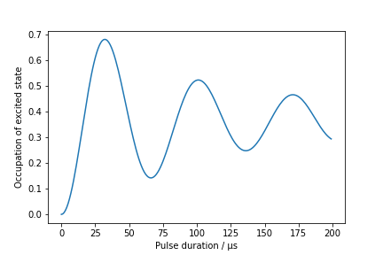

.. image:: https://readthedocs.org/projects/aisim/badge/?version=latest
    :target: https://aisim.readthedocs.io/en/latest/?badge=latest
    :alt: Documentation Status

AISim ‒ Simulations for light-pulse atom interferometry
=======================================================

AISim is a Python package for simulating light-pulse atom
interferometers.

It uses dedicated objects to model the lasers beams, the atomic ensemble
and the detection system and store experimental parameters in a neat
way. After you define these objects you can use built-in propagators to
simulate internal and external degrees of freedom of cold atoms.

Installation
------------

::

    git clone https://github.com/bleykauf/aisim.git
    cd aisim
    python setup.py install

Alternatively, if you plan to make changes to the code, use

::

    python setup.py develop

Usage
-----

The full documentation can be found `here <https://aisim.readthedocs.io>`__.

Import AISim plus numpy and matplotlib and print current version:

.. code:: python

    import numpy as np
    import matplotlib.pyplot as plt
    import aisim as ais
    print(ais.__version__)

::

    v0.4.0

As an example, we simulate Rabi oscillations driven by stimulated Raman
transitions in the presence of thermal motion.

.. note::
    If not explicitly stated otherwise in the docstring, units are assumed to be SI units
    **without** prefixes, i.e. meters or Kelvin. The only exception is kilogram.

First, we define a ``AtomicEnsemble`` object for atoms from a
magneto-optical trap after sub-Doppler cooling:

.. code:: python

    # spherical atomic cloud with radius 3 mm
    pos_params = {
         'mean_x': 0.0,
         'std_x' : 3.0e-3, 
         'mean_y': 0.0,
         'std_y' : 3.0e-3,
         'mean_z': 0.0,
         'std_z' : 3.0e-3
    }

    # cloud velocity spread in m/s at tempearture of 3 μK in x and y,
    # and 150 nK in z (after a velocity selection process):
    vel_params = {
         'mean_vx': 0.0,
         'std_vx' : ais.convert.vel_from_temp(3.0e-6), 
         'mean_vy': 0.0,
         'std_vy' : ais.convert.vel_from_temp(3.0e-6), 
         'mean_vz': 0.0,
         'std_vz' : ais.convert.vel_from_temp(150e-9)
    }

    # generate an AtomicEnsemble of 10000 atomsin the ground state
    atoms = ais.create_random_ensemble_from_gaussian_distribution(
        pos_params,
        vel_params, int(1e4),
        state_vectors=[1, 0])

Only a fraction of these atoms will be detected after a time-of-flight
of 800 ms. We model the detection region with radius of 5 mm:

.. code:: python

    det = ais.Detector(r_det=5e-3, t_det=800e-3)

We setup the two counter-propagating Raman laser beams with a wavelength
of 780 nm, 30 mm beam diameter and a Rabi frequency of 15 kHz as
``IntensityProfile`` and ``WaveVectors`` objects:

.. code:: python

    intensity_profile = ais.IntensityProfile(
        r_beam=15e-3,
        center_rabi_freq=2*np.pi*15e3)

    wave_vectors = ais.Wavevectors( k1=2*np.pi/780e-9, k2=-2*np.pi/780e-9)

We select the atoms that are eventually detected, let those freely
propagate for 100 ms before we start the Rabi oscillations up to 200 μs:

.. code:: python

    atoms = det.detected_atoms(atoms)
    atoms = ais.prop.free_evolution(atoms, dt=100e-3)

    state_occupation = []
    taus = np.arange(200)*1e-6
    for tau in taus:
        prop_atoms = ais.prop.transition(atoms, intensity_profile, tau, wave_vectors=wave_vectors)
        mean_occupation = np.mean(prop_atoms.state_occupation(state=1))
        state_occupation.append(mean_occupation)

Finally, we plot the results:

.. code:: python

    fig, ax = plt.subplots()
    ax.plot(1e6*taus, state_occupation)
    ax.set_xlabel('Pulse duration / μs')
    ax.set_ylabel('Occupation of excited state');

Examples
--------

Some more examples are provided in the form of `Jupyter
notebooks <https://jupyter.org/>`__:

-  `Effect of wavefront aberrations in atom
   interferometry <examples/wavefront-aberrations.ipynb>`__
-  `Rabi oscillations with a Gaussian beam and thermal
   atoms <examples/rabi-oscillations.ipynb>`__

Authors
-------

-  Bastian Leykauf (https://github.com/bleykauf)
-  Sascha Vowe (https://github.com/savowe)

License
-------

AISim is licensed under `GPL 3.0 <https://www.gnu.org/licenses/gpl-3.0.txt>`__.

