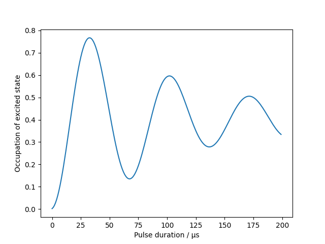

Usage
=====

Basic example
-------------

Import AISim plus numpy and matplotlib and print current version:

.. code:: python

    import numpy as np
    import matplotlib.pyplot as plt
    import aisim as ais
    from functools import partial
    print(ais.__version__)

As an example, we simulate Rabi oscillations driven by stimulated Raman transitions in the presence of thermal motion.

.. note::
    If not explicitly stated otherwise in the docstring, units are assumed to be SI units
    **without** prefixes, i.e. meters or Kelvin. The only exception is kilogram.

First, we define a ``AtomicEnsemble`` object for atoms from a
magneto-optical trap after sub-Doppler cooling:

.. code:: python

    # Generate an AtomicEnsemble of 10000 atoms in the ground state, in aspherical
    # atomic cloud with radius 3 mm with velocity spread in m/s at temperature of 3 μK
    # in x and y, and 150 nK in z (after a velocity selection process):
    atoms = ais.create_random_ensemble(
    int(1e4),
    x_dist=partial(ais.dist.position_dist_gaussian, std=3.0e-3),
    y_dist=partial(ais.dist.position_dist_gaussian, std=3.0e-3),
    z_dist=partial(ais.dist.position_dist_gaussian, std=3.0e-3),
    vx_dist=partial(ais.dist.velocity_dist_from_temp, temperature=3.0e-6),
    vy_dist=partial(ais.dist.velocity_dist_from_temp, temperature=3.0e-6),
    vz_dist=partial(ais.dist.velocity_dist_from_temp, temperature=150e-9),
    seed=1,
)

Only a fraction of these atoms will be detected after a time-of-flight
of 800 ms. We model the detection region with radius of 5 mm:

.. code:: python

    det = ais.SphericalDetector(t_det=800e-3, r_det=5e-3)

We select the atoms that are eventually detected, let those freely propagate for 100 ms

.. code:: python
    atoms = det.detected_atoms(atoms)
    free_prop = ais.FreePropagator(100e-3)
    atoms = free_prop.propagate(atoms)

We setup the two counter-propagating Raman laser beams with a wavelength
of 780 nm, 30 mm beam diameter and a Rabi frequency of 15 kHz as
``IntensityProfile`` and ``WaveVectors`` objects:

.. code:: python
    intensity_profile = ais.IntensityProfile(
        r_profile=15e-3, center_rabi_freq=2 * np.pi * 15e3
    )

    wave_vectors = ais.Wavevectors(k1=2 * np.pi / 780e-9, k2=-2 * np.pi / 780e-9)

    time_delta = 1e-6
    prop = ais.TwoLevelTransitionPropagator(
        time_delta, intensity_profile=intensity_profile, wave_vectors=wave_vectors
    )

We select the atoms that are eventually detected, let those freely
propagate for 100 ms before we start the Rabi oscillations up to 200 μs:

.. code:: python

    atoms = det.detected_atoms(atoms)
    atoms = ais.prop.free_evolution(atoms, dt=100e-3)

    state_occupation = []
    taus = np.arange(200) * time_delta
    for tau in taus:
        atoms = prop.propagate(atoms)
        mean_occupation = np.mean(atoms.state_occupation(state=1))
        state_occupation.append(mean_occupation)

Finally, we plot the results:

.. code:: python

    fig, ax = plt.subplots()
    ax.plot(1e6 * taus, state_occupation)
    ax.set_xlabel("Pulse duration / μs")
    ax.set_ylabel("Occupation of excited state");

More examples
-------------

The notebooks containing the following exampels can also be found 
`here <https://github.com/bleykauf/aisim/blob/master/docs/examples>`__:

-  `Effect of wavefront aberrations in atom interferometry <examples/wavefront-aberrations.ipynb>`__
-  `Rabi oscillations with a Gaussian beam and thermal atoms <examples/rabi-oscillations.ipynb>`__
-  `Multiport atom interferometer <examples/multiport-ai.ipynb>`__